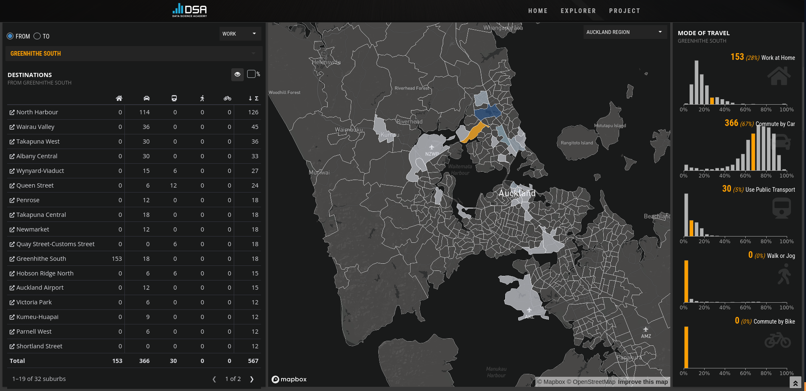

```{r setup}
#| include: false
library(ggplot2)
library(dplyr)
library(readr)
```

## Objectifs de l'atelier {.smaller}

- Introduire R pour l'analyse de données
  - Interface RStudio et console
  - Les objets et types de données
  - Les fonctions et packages
  - Import et manipulation de données
  - Analyse descriptive et graphiques

> Le but est que vous puissiez sortir d'ici avec une compréhension de base de R et que vous soyez capable d'aller chercher des ressources pour continuer à apprendre.

---

## Qu'est-ce que R ? {.smaller}

::: {.columns}
::: {.column width="50%"}
**R c'est :**

- Un langage de programmation pour l'analyse de données
- Gratuit et open-source
- Une communauté active mondiale
- Plus de 21,000 packages spécialisés

:::

::: {.column width="50%"}
**Pourquoi l'utiliser ?**

- Adapté aux sciences sociales
- Analyses reproductibles et transparentes
- Visualisations de qualité professionnelle
- Compétence recherchée en recherche et industrie

:::
:::

<br>

> Aujourd'hui nous allons apprendre les bases pour analyser de vraies données

---

## Pourquoi R en sciences sociales ? {.smaller background-color="#2C5F77"}

{.absolute top=0 left=900 width="20%"}

::: {style="color: white;"}

**R est utilisé dans la vraie vie :**

::: {.columns}
::: {.column width="50%"}
**Organisations :**

- [AirBnB](https://medium.com/airbnb-engineering/using-r-packages-and-education-to-scale-data-science-at-airbnb-906faa58e12d) - analyse de données
- [BBC](https://bbc.github.io/rcookbook/) - graphiques journalistiques
- Google, Facebook, Amazon - data science

:::

::: {.column width="50%"}
**Recherche au Québec :**

- [Vox Pop Labs](https://github.com/voxpoplabs) (Boussole électorale)
- CLESSN (Université Laval)
- Nombreux chercheurs en sciences sociales

:::
:::
:::

---

## Visualisations avancées avec R {.smaller background-color="#4A90A4"}

::: {style="color: white;"}

**Suivi quotidien des intentions de vote - Élections fédérales 2025**

:::

{fig-align="center" width="80%"}

::: {.callout-note}
Animation générée automatiquement chaque jour avec R - Centre d'analyse des politiques publiques
:::

---

## Au-delà des chiffres {.smaller background-color="#2C5F77"}

::: {style="color: white;"}

**R s'adapte à tous types de données**

::: {.columns}
::: {.column width="50%"}
**Texte :**

- Analyse de sentiment
- Classification de documents
- Transcription audio
- Extraction d'informations

:::

::: {.column width="50%"}
**Multimédia :**

- Analyse d'images
- Création de vidéos
- Infographies automatisées
- Présentations interactives

:::
:::
:::

---

## Applications web interactives avec Shiny {.smaller background-color="#4A90A4"}

::: {style="color: white;"}

**Explorez vos données de manière interactive**

:::

[{width="80%"}](https://nz-stefan.shinyapps.io/commute-explorer-2/)

::: {.callout-tip}
Cliquez sur l'image pour voir l'[application en action](https://nz-stefan.shinyapps.io/commute-explorer-2/)
:::

---

## Applications Shiny : possibilités infinies {.smaller background-color="#5B4E77"}

::: {style="color: white;"}

**Transformez vos analyses en outils accessibles**
**Exemples d'utilisation :**

- Tableaux de bord de suivi
- Explorateurs de données interactifs
- Outils de collecte de données
- Simulateurs et calculateurs
- Rapports personnalisés

::: {.callout-note}
Aucune connaissance en développement web nécessaire
:::
:::

---

## Et après R ? {.smaller background-color="#2C5F77"}

::: {style="color: white;"}

**Apprendre R ouvre la porte à d'autres langages**

Les concepts appris en R se transfèrent facilement :

::: {.columns}
::: {.column width="50%"}
**Analyse de données :**

- Python (data science)
- Julia (calcul scientifique)
- SQL (bases de données)

:::

::: {.column width="50%"}
**Développement :**

- JavaScript (web interactif)
- HTML/CSS (présentation)
- Bash (automatisation)

:::
:::

::: {.callout-note}
Une fois qu'on maîtrise un langage de programmation, les autres deviennent beaucoup plus faciles à apprendre
:::
:::

---

## Installer R et RStudio {.smaller}

::: {.columns}
::: {.column width="50%"}
**Quelle est la différence ?**

- R est le moteur, RStudio est le véhicule
- R est le langage, RStudio est la feuille de papier
- RStudio facilite l'utilisation de R
- RStudio est un IDE (Integrated Development Environment)
- Personnalisation de l'environnement de travail
:::

::: {.column width="50%"}
**Liens de téléchargement :**

- [Installer R](https://cran.r-project.org/)
- [Installer RStudio](https://www.rstudio.com/products/rstudio/download/)
:::
:::

---

## Avant de commencer à coder : RStudio {.smaller}

{.absolute top="100" left="0" width="100%" height="80%"}

::: {.absolute top="250" left="80" style="background-color: rgba(255,255,255,0.9); padding: 15px; border-radius: 10px; max-width: 280px;"}
**Script**  
Où on écrit notre code
:::

::: {.absolute top="200" left="600" style="background-color: rgba(255,255,255,0.9); padding: 15px; border-radius: 10px; max-width: 280px;"}
**Environment**  
Nos objets et données
:::

::: {.absolute top="500" left="80" style="background-color: rgba(255,255,255,0.9); padding: 15px; border-radius: 10px; max-width: 280px;"}
**Console**  
Où s'exécutent les commandes
:::

::: {.absolute top="450" left="600" style="background-color: rgba(255,255,255,0.9); padding: 15px; border-radius: 10px; max-width: 280px;"}
**Files/Plots**  
Fichiers et graphiques
:::

---

## R comme calculatrice {.smaller}

::: {.callout-tip}
## À tester dans la console
:::

```{r}
#| code-copy: true
# Opérations de base
2 + 3
10 * 5
15 / 3
sqrt(16)
```

::: {.fragment}
```{r}
#| code-copy: true
# Un peu plus complexe
(10 + 5) * 2
2^3  # puissance
```
:::


---

## Créer nos premiers objets {.smaller}

En R, on sauvegarde tout dans des **objets** avec `<-`

```{r}
# Créer des objets simples
film_prefere <- "Dune"
annee_sortie <- 2021
note_imdb <- 8.0
```

```{r}
# Voir le contenu des objets
film_prefere
annee_sortie
note_imdb
```

::: {.callout-note}
**Important :** Les objets apparaissent dans le panneau Environment de RStudio !
:::

---

## Les vecteurs : groupes de valeurs

```{r}
# Créer des vecteurs avec la fonction c()
films <- c("Dune", "Oppenheimer", "Barbie", "The Zone of Interest", "Killers of the Flower Moon")
annees <- c(2021, 2023, 2023, 2023, 2023)
notes_imdb <- c(8.0, 8.3, 6.8, 7.4, 7.6)
```

```{r}
# Explorer nos vecteurs
films
length(films)     # nombre de films
mean(notes_imdb)  # note moyenne
```

---

## Types de données : attention aux pièges !

```{r}
# Vérifier le type de nos objets
class(notes_imdb)    # numérique - parfait pour calculer
class(films)         # caractère (texte)
class(c(TRUE, FALSE))  # logique
```

::: {.callout-warning}
## Problème fréquent en analyse de données
Parfois, des nombres sont stockés comme du texte dans vos données. R ne peut pas calculer avec du texte !
:::

---

## Types de données : attention aux pièges !

```{r}
# Exemple de coercition automatique (à surveiller !)
notes_mixtes <- c(8.0, 7.5, "6.8")  # un chiffre écrit en texte
notes_mixtes
class(notes_mixtes)  # tout devient du texte !
```

```{r}
# Impossible de calculer maintenant
 mean(notes_mixtes)  # Ceci produira une erreur !
```

---

## Solution : convertir les types

```{r}
# Convertir du texte en numérique
notes_numeriques <- as.numeric(notes_mixtes)
notes_numeriques
class(notes_numeriques)

# Maintenant on peut calculer
mean(notes_numeriques)
```

::: {.callout-tip}
## Bonne pratique
Toujours vérifier le type de vos variables avec `class()` avant de faire des calculs !
:::

---

## Notre premier tableau de données

Un **data frame** = tableau avec lignes et colonnes

```{r}
# Créer notre base de données de films
cinema <- data.frame(
  titre = c("Dune", "Oppenheimer", "Barbie", "The Zone of Interest", "Killers of the Flower Moon"),
  annee = c(2021, 2023, 2023, 2023, 2023),
  note = c(8.0, 8.3, 6.8, 7.4, 7.6),
  genre = c("Sci-Fi", "Biographie", "Comédie", "Drame", "Drame")
)
```

```{r}
# Regarder notre tableau
cinema
```

---

## Explorer un data frame

```{r}
# Informations générales
dim(cinema)       # dimensions (lignes x colonnes)
nrow(cinema)      # nombre de films
ncol(cinema)      # nombre de variables
names(cinema)     # noms des colonnes
```

---

## Explorer un data frame

```{r}
# Aperçu du contenu
head(cinema, 3)   # premiers films
str(cinema)       # structure détaillée
```

---

## Accéder aux colonnes

### Avec le symbole `$` (recommandé)

```{r}
cinema$titre
cinema$note
mean(cinema$note)  # note moyenne
```

---

## Accéder aux colonnes
### Avec les crochets `[ ]`

```{r}
cinema[, "titre"]          # par nom
cinema[, 1]                # par position
cinema[, c("titre", "genre")] # plusieurs colonnes
```

---

## Les fonctions : nos outils

Une **fonction** fait une tâche : `fonction(argument1, argument2)`

```{r}
# Fonctions statistiques essentielles
mean(cinema$note)      # note moyenne
median(cinema$note)    # note médiane
sd(cinema$note)        # écart-type
min(cinema$note)       # note minimale
max(cinema$note)       # note maximale
```

---

## Les fonctions : nos outils

```{r}
# Résumé complet d'une variable
summary(cinema$note)
```

```{r}
# Compter les occurrences
table(cinema$genre)    # combien de films par genre ?
```

---

## Les packages : étendre R {.smaller}

**Les packages sont comme des applications pour R**

- R de base = fonctions essentielles
- Packages = fonctions spécialisées créées par la communauté
- Plus de 21,000 packages disponibles sur CRAN
- Chaque package résout des problèmes spécifiques

::: {.callout-tip}
## Analogie
R de base = téléphone vide  
Packages = applications qu'on télécharge
:::

---

## Le Tidyverse : votre boîte à outils {.smaller}

**Collection de packages pour l'analyse de données moderne**

::: {.columns}
::: {.column width="50%"}
**Packages principaux :**

- `readr` : importer des données
- `dplyr` : manipuler des données
- `ggplot2` : créer des graphiques
- `tidyr` : nettoyer des données
:::

::: {.column width="50%"}
**Avantages :**

- Syntaxe cohérente et intuitive
- Très utilisé en sciences sociales
- Documentation excellente
- S'installe en un seul package !
:::
:::

```{r}
#| eval: false
#| code-copy: true
# Installer le Tidyverse (contient plusieurs packages)
install.packages("tidyverse")
```

---

## Installation vs Chargement {.smaller}

::: {.callout-important}
## Différence cruciale
- `install.packages("nom")` : télécharger le package (1 seule fois)
- `library(nom)` : activer le package (à chaque session R)
:::

**Installer des packages**

```{r}
#| eval: false
#| code-copy: true
# Exemples d'installation (à faire une fois)
install.packages("tidyverse")
install.packages("readxl")
install.packages("janitor")
```

::: {.fragment}
**Charger des packages**

```{r}
#| code-copy: true
# À faire au début de chaque script
library(tidyverse)
library(readxl)
```
:::

::: {.callout-tip}
## Bonne pratique
Mettez toujours vos `library()` au début de votre script
:::

---


## Comprendre l'organisation de votre ordinateur {.smaller}

::: {.callout-important}
## Votre ordinateur = une grande bibliothèque
Chaque fichier a une **adresse précise** pour le retrouver !
:::

**Exemple d'organisation :**
```
📁 Mon ordinateur
  📁 Documents
    📁 Université
      📁 Session_Hiver2024
        📁 Cours_R
          📄 donnees.csv
          📄 mon_script.R
```

**L'adresse complète (chemin) :**

- Windows : `C:/Documents/Université/Session_Hiver2024/Cours_R/`
- Mac : `/Users/votrenom/Documents/Université/Session_Hiver2024/Cours_R/`

---

## Où travaille R en ce moment ? {.smaller}

::: {.callout-tip}
## À tester maintenant !
:::

```{r}
#| code-copy: true
# Où suis-je actuellement ?
getwd()  # "get working directory" = obtenir le dossier de travail
```

::: {.fragment}
```{r}
#| code-copy: true
# Qu'est-ce qu'il y a dans ce dossier ?
list.files()  # lister tous les fichiers
```
:::

**R travaille toujours dans UN dossier à la fois !**  
C'est son "bureau" où il cherche vos fichiers par défaut.

---

## Bien organiser son projet R {.smaller}

::: {.callout-note}
## Structure recommandée
```
📁 Mon_Projet_R/
  📁 code/              # tous vos scripts R
    📄 analyse.R
    📄 graphiques.R
  📁 data/              # tous vos fichiers CSV, Excel
    📄 titanic.csv
    📄 sondage.xlsx  
  📁 graphs/            # vos graphiques exportés
    📄 histogram_ages.png
  📁 outputs/           # vos résultats et rapports
    📄 resultats.csv
```
:::

**Pourquoi c'est important ?**

- Tout est au même endroit
- Facile de retrouver ses fichiers
- On peut partager le dossier complet à quelqu'un

---

## Changer le dossier de travail de R {.smaller}

**Méthode 1 : Avec du code**
```{r}
#| eval: false
#| code-copy: true
# Changer vers mon dossier de projet
setwd("C:/Documents/Université/Mon_Projet_R")   # Windows
setwd("/Users/nom/Documents/Mon_Projet_R")      # Mac

# Vérifier que ça a marché
getwd()
```

::: {.fragment}
**Méthode 2 : Menu RStudio**
`Session` → `Set Working Directory` → `Choose Directory...`
:::

::: {.callout-warning}
**Attention :** Il faut refaire `setwd()` à chaque fois qu'on ouvre RStudio !
:::

---

## Lien entre RStudio et votre dossier {.smaller}

::: {.columns}
::: {.column width="50%"}
**Dans RStudio :**

- **Console** : `getwd()` montre où on est
- **Panneau Files** (bas-droite) : navigue dans les dossiers
- **Environment** : vos objets R en mémoire

:::

::: {.column width="50%"}
**Sur votre ordinateur :**

- **Explorateur de fichiers** (Windows) ou **Finder** (Mac)
- Même structure de dossiers
- Les fichiers existent vraiment !

:::
:::

::: {.callout-tip}
## Astuce
Le panneau **Files** de RStudio montre le même contenu que `list.files()` !
:::

---

## Maintenant on peut charger nos données ! {.smaller}

::: {.callout-success}
**Méthode propre**

1. Créez un dossier pour votre projet
2. Mettez-y vos fichiers de données  
3. Utilisez `setwd()` pour y aller
4. Maintenant R trouve vos fichiers !
:::

```{r}
#| eval: false
#| code-copy: true
# Étapes pratiques :
setwd("C:/Mon_Projet_R")              # Remplacer par cotre propre chemin
list.files()                          # voir mes dossiers : code, data, graphs...
donnees <- read.csv("data/titanic.csv")  # charger depuis le dossier data
```

**Prochaine slide :** On va charger les vraies données du Titanic !


---

## Charger de vraies données {.smaller background-color="#4A90A4"}

::: {style="color: #333;"}

Utilisons les données **Titanic** pour pratiquer !

```{r}
#| code-copy: true
# Charger les données Titanic
titanic <- read.csv("data/titanic.csv")

# Premier coup d'œil
head(titanic, 3)
```

::: {.callout-tip}
## Téléchargez les données
Cliquez sur ce [lien](https://web.stanford.edu/class/archive/cs/cs109/cs109.1166/stuff/titanic.csv) 

Attention de bien spécifier votre chemin d'accès!
:::
:::

---

## Explorer la structure des données {.smaller background-color="#4A90A4"}

::: {style="color: #333;"}

**Toujours commencer par comprendre nos données**

```{r}
#| code-copy: true
# Informations de base
dim(titanic)          # dimensions (lignes x colonnes)
names(titanic)        # noms des colonnes
nrow(titanic)         # nombre de lignes
ncol(titanic)         # nombre de colonnes
```
:::

---

## Examiner la structure détaillée {.smaller background-color="#4A90A4"}

::: {style="color: #333;"}

```{r}
#| code-copy: true
# Structure complète des données
str(titanic)
```

::: {.fragment}
```{r}
#| code-copy: true
# Aperçu moderne avec glimpse (dplyr)
library(dplyr)
glimpse(titanic)
```
:::

**Ces fonctions montrent :** types de variables, premières valeurs, dimensions
:::

---

## Résumé statistique des variables {.smaller background-color="#4A90A4"}

::: {style="color: #333;"}

```{r}
#| code-copy: true
# Résumé statistique de toutes les variables
summary(titanic)
```

**Ce résumé nous révèle :**
Moyennes, médianes, quartiles pour les variables numériques | Fréquences pour les variables catégorielles | Présence de valeurs manquantes (NA's)
:::

---

## Gérer les valeurs manquantes {.smaller background-color="#4A90A4"}

::: {style="color: #333;"}

```{r}
#| code-copy: true
# Compter les valeurs manquantes par colonne
colSums(is.na(titanic))
```

::: {.fragment}
```{r}
#| code-copy: true
# Compter les NA dans une colonne spécifique
sum(is.na(titanic$Age))

# Voir quels passagers ont un âge manquant
head(titanic[is.na(titanic$Age), ])
```
:::

::: {.callout-note}
**na.rm = TRUE** dans les fonctions statistiques ignore les valeurs manquantes
:::
:::

---

## Analyse des variables individuelles {.smaller background-color="#4A90A4"}

::: {style="color: #333;"}

```{r}
#| code-copy: true
# Variables catégorielles : compter les occurrences
table(titanic$Survived)    # survivants
table(titanic$Pclass)      # classes
table(titanic$Sex)         # sexe
```

::: {.fragment}
```{r}
#| code-copy: true
# En pourcentages
prop.table(table(titanic$Survived)) * 100
```
:::
:::

---

## Analyse des variables numériques {.smaller background-color="#4A90A4"}

::: {style="color: #333;"}

```{r}
#| code-copy: true
# Statistiques sur l'âge
mean(titanic$Age, na.rm = TRUE)     # âge moyen
median(titanic$Age, na.rm = TRUE)   # âge médian
sd(titanic$Age, na.rm = TRUE)       # écart-type
range(titanic$Age, na.rm = TRUE)    # min et max
```

::: {.fragment}
```{r}
#| code-copy: true
# Statistiques sur le prix du billet
summary(titanic$Fare)
```
:::
:::

---

## Analyse croisée de variables {.smaller background-color="#4A90A4"}

::: {style="color: #333;"}

```{r}
#| code-copy: true
# Croiser deux variables catégorielles
table(titanic$Pclass, titanic$Survived)
```

::: {.fragment}
```{r}
#| code-copy: true
# Ajouter les noms de lignes/colonnes pour clarté
table(Classe = titanic$Pclass, Survécu = titanic$Survived)
```
:::

**Ce tableau montre :** répartition des survivants selon la classe
:::

---

## Manipulation des données avec dplyr {.smaller background-color="#4A90A4"}

::: {style="color: #333;"}

**Le package dplyr facilite la manipulation de données**

```{r}
#| code-copy: true
# Charger dplyr (ou tidyverse)
library(dplyr)
```

**Fonctions principales :**

- `select()` : sélectionner des colonnes
- `filter()` : filtrer des lignes
- `mutate()` : créer/modifier des variables
- `group_by()` + `summarise()` : grouper et résumer
:::

---

## Sélectionner des colonnes {.smaller background-color="#4A90A4"}

::: {style="color: #333;"}

```{r}
#| code-copy: true
# Garder seulement certaines colonnes
titanic_simple <- titanic %>%
  select(Survived, Pclass, Sex, Age, Fare)

head(titanic_simple, 3)
```

:::

---

## Filtrer des lignes {.smaller background-color="#4A90A4"}

::: {style="color: #333;"}

```{r}
#| code-copy: true
# Filtrer les passagers de première classe
premiere_classe <- titanic %>%
  filter(Pclass == 1)

nrow(premiere_classe)  # combien de passagers ?
```

::: {.fragment}
```{r}
#| code-copy: true
# Filtres multiples
adultes_survie <- titanic %>%
  filter(Age >= 18, Survived == 1)

nrow(adultes_survie)
```
:::

**Opérateurs de filtre :** `==`, `!=`, `>`, `<`, `>=`, `<=`, `%in%`
:::

---

## Créer de nouvelles variables {.smaller background-color="#4A90A4"}

::: {style="color: #333;"}

```{r}
#| code-copy: true
# Créer une variable catégorielle âge
titanic <- titanic %>%
  mutate(groupe_age = ifelse(Age < 18, "Enfant", "Adulte"))

table(titanic$groupe_age)
```

::: {.fragment}
```{r}
#| code-copy: true
# Créer plusieurs variables en une fois
titanic <- titanic %>%
  mutate(
    prix_eleve = ifelse(Fare > 50, "Cher", "Abordable"),
    taille_famille = Siblings.Spouses.Aboard + Parents.Children.Aboard + 1  # inclure le passager lui-même
  )

# Visualiser les premières lignes des nouvelles variables
titanic_newvars <- titanic %>%
  select(groupe_age, prix_eleve, taille_famille)

head(titanic_newvars)
```
:::
:::

---

## Nettoyage de données avancé {.smaller background-color="#4A90A4"}

::: {style="color: #333;"}

```{r}
#| code-copy: true
# Stratégie pour gérer les valeurs manquantes dans la variable Age
# Étape 1: Remplacer les NA par la médiane des âges existants
titanic <- titanic %>%
  mutate(Age = ifelse(is.na(Age),                    # SI l'âge est manquant (NA)
                      median(Age, na.rm = TRUE),      # ALORS utiliser la médiane
                      Age))                           # SINON garder l'âge original

# Étape 2: Vérifier que le remplacement a fonctionné
sum(is.na(titanic$Age))  # Compter combien de NA restent (devrait être 0)
```

::: {.fragment}
```{r}
#| code-copy: true
# Standardiser les noms de colonnes (optionnel)
titanic <- titanic %>%
  rename(
    survie = Survived,
    classe = Pclass,
    sexe = Sex
  )
```
:::
:::

---

## Grouper et résumer {.smaller background-color="#4A90A4"}

::: {style="color: #333;"}

```{r}
#| code-copy: true
# Statistiques par groupe
titanic %>%
  group_by(classe) %>%
  summarise(
    nb_passagers = n(),
    nb_survivants = sum(survie),
    taux_survie = round(mean(survie) * 100, 1),
    age_moyen = round(mean(Age, na.rm = TRUE), 1)
  )
```

**La fonction `n()` compte le nombre de lignes dans chaque groupe**
:::

---

## Groupements multiples {.smaller background-color="#4A90A4"}

::: {style="color: #333;"}

```{r}
#| code-copy: true
# Analyser par classe ET sexe
resume_complet <- titanic %>%
  group_by(classe, sexe) %>%
  summarise(
    nb_passagers = n(),
    taux_survie = round(mean(survie) * 100, 1)
  )

resume_complet
```
:::

---

## Graphiques simples : graphiques en barres {.smaller background-color="#4A90A4"}

::: {style="color: #333;"}

**Commençons par le plus simple : compter des catégories**

```{r}
#| code-copy: true
#| fig-height: 4
#| fig-align: center
library(ggplot2)

# Nombre de passagers par classe
ggplot(titanic, aes(x = factor(classe))) +
  geom_bar()
```
:::

---

## Observation: la fonction factor() : transformer en catégories {.smaller background-color="rgba(206, 87, 87, 1)"}

::: {style="color: #333;"}

**Pourquoi `factor(classe)` dans nos graphiques ?**

```{r}
#| code-copy: true
# Notre variable classe contient des chiffres
class(titanic$classe)  # "numeric" 
table(titanic$classe)  # 1, 2, 3
```

::: {.fragment}
```{r}
#| code-copy: true
# R peut les voir comme des NOMBRES ou comme des CATÉGORIES
# factor() dit à R : "Traite ça comme des catégories !"
class(factor(titanic$classe))  # "factor"
```
:::
:::

---

## Observation: la fonction factor() : transformer en catégories {.smaller background-color="rgba(206, 87, 87, 1)"}

::: {style="color: #333;"}

**Différence visuelle dans les graphiques :**

- Sans `factor()` : axe continu avec espaces bizarres
- Avec `factor()` : barres bien distinctes pour chaque classe

::: {.callout-tip}
**Character vs Factor :** `as.character()` marche aussi, mais `factor()` nous donne plus de contrôle sur l'ordre d'affichage !
:::
:::

---

## Graphiques simples : graphiques en barres {.smaller background-color="#4A90A4"}

::: {style="color: #333;"}

**Éléments de base :**

- `ggplot()` : initialise le graphique avec les données
- `aes()` : spécifie quelles variables utiliser
- `geom_bar()` : type de graphique (barres)
:::

---

## Ajouter des couleurs et labels {.smaller background-color="#4A90A4"}

::: {style="color: #333;"}

```{r}
#| code-copy: true
#| fig-height: 4
#| fig-align: center
# Même graphique, mais plus joli
ggplot(titanic, aes(x = factor(classe))) +
  geom_bar(fill = "steelblue", color = "white") +
  labs(
    title = "Répartition des passagers par classe",
    x = "Classe", 
    y = "Nombre de passagers"
  ) +
  theme_minimal()
```
:::

---

## Ajouter des couleurs et labels {.smaller background-color="#4A90A4"}

::: {style="color: #333;"}

**Nouveaux éléments :**

- `fill` : couleur de remplissage des barres
- `labs()` : ajouter titres et étiquettes
- `theme_minimal()` : style épuré
:::

---

## Graphiques empilés : deux variables {.smaller background-color="#4A90A4"}

::: {style="color: #333;"}

**Nouvelle technique :** `fill = factor(survie)` dans `aes()` crée des couleurs automatiques selon la survie

```{r}
#| code-copy: true
#| fig-height: 4
#| fig-align: center
# Survivants par classe (barres empilées)
ggplot(titanic, aes(x = factor(classe), fill = factor(survie))) +
  geom_bar() +
  labs(
    title = "Survivants par classe sur le Titanic",
    x = "Classe", 
    y = "Nombre de passagers",
    fill = "Survécu"
  ) +
  theme_minimal()

```

:::

---

## Graphiques en proportions {.smaller background-color="#4A90A4"}

::: {style="color: #333;"}

**`position = "fill"`** transforme en proportions (0 à 1) pour comparer les taux

```{r}
#| code-copy: true
#| fig-height: 4
#| fig-align: center
# Proportions plutôt que nombres absolus
ggplot(titanic, aes(x = factor(classe), fill = factor(survie))) +
  geom_bar(position = "fill") +
  labs(
    title = "Taux de survie par classe",
    x = "Classe", 
    y = "Proportion",
    fill = "Survécu"
  ) +
  theme_minimal()
```

:::

---

## Histogrammes : distribution d'une variable {.smaller background-color="#4A90A4"}

::: {style="color: #333;"}

```{r}
#| code-copy: true
#| fig-height: 4
#| fig-align: center
# Distribution des âges
ggplot(titanic, aes(x = Age)) +
  geom_histogram(bins = 20, fill = "lightblue", color = "white", alpha = 0.7) +
  labs(
    title = "Distribution des âges sur le Titanic",
    x = "Âge", 
    y = "Nombre de passagers"
  ) +
  theme_minimal()
```
:::

---

## Histogrammes : distribution d'une variable {.smaller background-color="#4A90A4"}

::: {style="color: #333;"}

**Nouveaux éléments :**

- `geom_histogram()` : pour variables numériques continues
- `bins = 20` : nombre de barres
- `alpha = 0.7` : transparence (0 = invisible, 1 = opaque)
:::

---

## Nuages de points {.smaller background-color="#4A90A4"}

::: {style="color: #333;"}

**`geom_point()`** crée un nuage de points pour explorer les relations entre variables numériques

```{r}
#| code-copy: true
#| fig-height: 4
#| fig-align: center
# Relation âge-prix du billet
ggplot(titanic, aes(x = Age, y = Fare)) +
  geom_point(alpha = 0.6) +
  labs(
    title = "Âge vs Prix du billet",
    x = "Âge", 
    y = "Prix du billet"
  ) +
  theme_minimal()
```

:::

---

## Nuages de points avec couleurs {.smaller background-color="#4A90A4"}

::: {style="color: #333;"}

**La couleur révèle des patterns :** les survivants avaient-ils des billets plus chers ?

```{r}
#| code-copy: true
#| fig-height: 4
#| fig-align: center
# Ajouter la survie comme couleur
ggplot(titanic, aes(x = Age, y = Fare, color = factor(survie))) +
  geom_point(alpha = 0.6) +
  labs(
    title = "Âge vs Prix du billet selon la survie",
    x = "Âge", 
    y = "Prix du billet",
    color = "Survécu"
  ) +
  theme_minimal()
```

:::

---

## Sauvegarder notre travail {.smaller background-color="#4A90A4"}

::: {style="color: #333;"}

```{r}
#| eval: false
#| code-copy: true
# Sauvegarder le dernier graphique
ggsave("age_prix_survie.png", width = 10, height = 6)

# Sauvegarder des données nettoyées
write.csv(titanic, "titanic_nettoye.csv", row.names = FALSE)

# Sauvegarder nos résultats d'analyse
write.csv(resume_complet, "analyse_survie_classe_sexe.csv", row.names = FALSE)
```

**Toujours sauvegarder :** scripts, données nettoyées, graphiques, résultats
:::

---

## Messages d'erreur : pas de panique ! {.smaller background-color="#4A90A4"}

::: {style="color: #333;"}

**Erreurs courantes et solutions :**

```{r}
#| eval: false
#| code-copy: true
# Erreur : objet non trouvé
mean(donnees$age)
# Error: object 'donnees' not found
# → Vérifier le nom de l'objet

# Erreur : colonne inexistante  
titanic$ages  # au lieu de Age
# → Utiliser names(titanic) pour voir les vraies colonnes

# Erreur : parenthèse manquante
mean(titanic$Age
# → Vérifier que toutes les parenthèses sont fermées
```

**Réflexes :** lire le message, vérifier l'orthographe, tester ligne par ligne
:::

---

## Bonnes pratiques pour l'analyse {.smaller background-color="#4A90A4"}

::: {style="color: #333;"}

::: {.callout-tip}
## Workflow recommandé

1. **Explorer d'abord :** `str()`, `summary()`, `glimpse()`
2. **Nettoyer ensuite :** gérer les NA, corriger les types
3. **Analyser pas à pas :** une variable, puis des croisements
4. **Visualiser pour comprendre :** graphiques simples puis complexes
5. **Documenter et sauvegarder :** commenter le code, sauvegarder les résultats
:::

```{r}
#| eval: false
#| code-copy: true
# Exemple de code bien structuré
# 1. Chargement et exploration
titanic <- read.csv("data/titanic.csv")
str(titanic)

# 2. Nettoyage
titanic <- titanic %>% 
  mutate(Age = ifelse(is.na(Age), median(Age, na.rm = TRUE), Age))

# 3. Analyse et visualisation
# ... votre analyse ...
```
:::

---

## Ce qu'on a appris aujourd'hui {.smaller}

::: {.callout-note}
## Récapitulatif

✅ Interface RStudio et console  
✅ Objets, vecteurs et data frames  
✅ Types de données et fonctions  
✅ Import et exploration de données  
✅ Analyse descriptive (moyennes, tableaux)  
✅ Premiers graphiques avec ggplot2  
✅ Manipulation avec dplyr (filter, select, group_by)
:::

**Vous pouvez maintenant :**

- Charger des données
- Les explorer et les résumer
- Créer des graphiques de base
- Faire des analyses descriptives simples

---

## Ressources pour continuer {.smaller}

**Documentation et aide :**

- `?fonction` dans R (ex: `?mean`)
- [R Documentation](https://www.rdocumentation.org/)
- [RStudio Cheatsheets](https://posit.co/resources/cheatsheets/)

**Apprentissage :**

- [swirl](https://swirlstats.com/) - apprendre R dans R
- [R for Data Science](https://r4ds.hadley.nz/) (gratuit en ligne)
- ChatGPT pour déboguer vos erreurs !

**Communauté :**

- [Stack Overflow](https://stackoverflow.com/questions/tagged/r)
- [RStudio Community](https://community.rstudio.com/)

---

## Questions ? {.smaller}

::: {.callout-tip appearance="simple"}
## Merci pour votre attention !

**Contact :** etienne.proulx.2@ulaval.ca

**Tous les codes sont copiables depuis cette présentation**
:::


**Prochaines étapes :** Continuez avec vos propres données et n'hésitez pas à expérimenter !