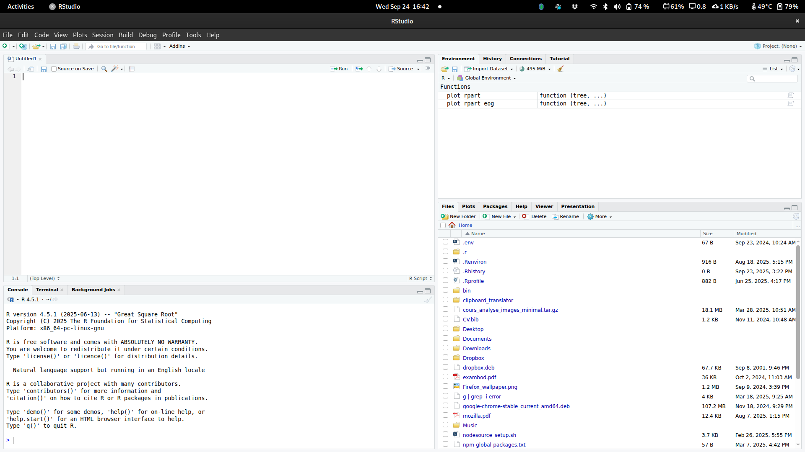

```{r setup}
#| include: false
library(ggplot2)
library(dplyr)
library(readr)
library(tidyverse)
library(wordcloud)
```

## Bienvenue ! {.smaller}

::: {.columns}
::: {.column width="60%"}
**Au programme aujourd'hui :**

- <i class="fa-solid fa-screwdriver-wrench"></i> **Bases** : Objets, fonctions et packages
- <i class="fa-solid fa-file-import"></i> **Données** : Importer et formater (Tidyverse)
- <i class="fa-solid fa-chart-line"></i> **Quantitatif** : Statistiques descriptives et visualisation
- <i class="fa-solid fa-cloud"></i> **Qualitatif** : Analyse de texte et nuages de mots

**Logistique :**
- <i class="fa-solid fa-clock"></i> **9h - 12h** : Formation théorique (Hybride)
- <i class="fa-solid fa-utensils"></i> **12h - 13h** : Pause dîner
- <i class="fa-solid fa-laptop-code"></i> **13h - 15h** : Atelier pratique (Présentiel BNF-4285)
:::

::: {.column width="40%"}
::: {.callout-important}
## <i class="fa-solid fa-link"></i> Site de la formation
**[www.etienneproulx.org/R_intro_fss/](https://www.etienneproulx.org/R_intro_fss/)**
:::

::: {.callout-note}
## Matériel requis
- R et RStudio installés
- **[Télécharger : Données Titanic (CSV)](data/titanic.csv)**
- Motivation !
:::

::: {.callout-tip}
## Aide & Mentorat
N'hésitez pas à poser vos questions sur Zoom ou en classe ! Nos mentors sont là pour vous aider.
:::
:::
:::

# <i class="fa-solid fa-layer-group"></i> Fondations : R & RStudio

## RStudio : Votre tableau de bord {.smaller}

{.absolute top="150" left="0" width="100%" height="75%"}

::: {.absolute top="300" left="80" style="background-color: rgba(255,255,255,0.95); padding: 15px; border-left: 5px solid #FFB81C; border-radius: 5px; max-width: 300px;"}
**1. Script**  
C'est votre recette. On écrit ici pour pouvoir tout relancer plus tard.
:::

::: {.absolute top="250" left="1200" style="background-color: rgba(255,255,255,0.95); padding: 15px; border-left: 5px solid #FFB81C; border-radius: 5px; max-width: 300px;"}
**2. Environnement**  
C'est votre garde-manger. Vos données et objets y sont stockés.
:::

::: {.absolute top="650" left="80" style="background-color: rgba(255,255,255,0.95); padding: 15px; border-left: 5px solid #FFB81C; border-radius: 5px; max-width: 300px;"}
**3. Console**  
C'est le four. Le code s'y exécute réellement.
:::

::: {.absolute top="600" left="1200" style="background-color: rgba(255,255,255,0.95); padding: 15px; border-left: 5px solid #FFB81C; border-radius: 5px; max-width: 300px;"}
**4. Fichiers/Graphiques**  
C'est votre fenêtre sur le monde. On y voit nos dossiers et nos résultats.
:::

---

## Rappel : R comme calculatrice {.smaller}

::: {.callout-tip}
## À tester dans la console
Essayez ces commandes pour vous dégourdir les doigts.
:::

```{r}
#| code-copy: true
# Opérations de base
(10 + 5) * 2
sqrt(16)
2^3  # puissance
```


---

## Créer nos premiers objets {.smaller}

En R, on sauvegarde tout dans des **objets** avec `<-`

```{r}
# Créer des objets simples
film_prefere <- "Dune"
annee_sortie <- 2021
note_imdb <- 8.0
```

```{r}
# Voir le contenu des objets
film_prefere
annee_sortie
note_imdb
```

::: {.callout-note}
**Important :** Les objets apparaissent dans le panneau Environment de RStudio !
:::

---

## Les vecteurs : groupes de valeurs

```{r}
# Créer des vecteurs avec la fonction c()
films <- c("Dune", "Oppenheimer", "Barbie", "The Zone of Interest", "Killers of the Flower Moon")
annees <- c(2021, 2023, 2023, 2023, 2023)
notes_imdb <- c(8.0, 8.3, 6.8, 7.4, 7.6)
```

```{r}
# Explorer nos vecteurs
films
length(films)     # nombre de films
mean(notes_imdb)  # note moyenne
```

---

## Types de données : attention aux pièges !

```{r}
# Vérifier le type de nos objets
class(notes_imdb)    # numérique - parfait pour calculer
class(films)         # caractère (texte)
class(c(TRUE, FALSE))  # logique
```

::: {.callout-warning}
## Problème fréquent en analyse de données
Parfois, des nombres sont stockés comme du texte dans vos données. R ne peut pas calculer avec du texte !
:::

---

## Types de données : attention aux pièges !

```{r}
# Exemple de coercition automatique (à surveiller !)
notes_mixtes <- c(8.0, 7.5, "6.8")  # un chiffre écrit en texte
notes_mixtes
class(notes_mixtes)  # tout devient du texte !
```

```{r}
# Impossible de calculer maintenant
 mean(notes_mixtes)  # Ceci produira une erreur !
```

---

## Solution : convertir les types

```{r}
# Convertir du texte en numérique
notes_numeriques <- as.numeric(notes_mixtes)
notes_numeriques
class(notes_numeriques)

# Maintenant on peut calculer
mean(notes_numeriques)
```

::: {.callout-tip}
## Bonne pratique
Toujours vérifier le type de vos variables avec `class()` avant de faire des calculs !
:::

---

## <i class="fa-solid fa-table"></i> Notre premier tableau de données

Un **data frame** = tableau avec lignes et colonnes

```{r}
# Créer notre base de données de films
cinema <- data.frame(
  titre = c("Dune", "Oppenheimer", "Barbie", "The Zone of Interest", "Killers of the Flower Moon"),
  annee = c(2021, 2023, 2023, 2023, 2023),
  note = c(8.0, 8.3, 6.8, 7.4, 7.6),
  genre = c("Sci-Fi", "Biographie", "Comédie", "Drame", "Drame")
)
```

```{r}
# Regarder notre tableau
cinema
```

---

## <i class="fa-solid fa-microscope"></i> Explorer un data frame

```{r}
# Informations générales
dim(cinema)       # dimensions (lignes x colonnes)
nrow(cinema)      # nombre de films
ncol(cinema)      # nombre de variables
names(cinema)     # noms des colonnes
```

---

## <i class="fa-solid fa-columns"></i> Accéder aux colonnes

### Avec le symbole `$` (recommandé)

```{r}
cinema$titre
cinema$note
mean(cinema$note)  # note moyenne
```

---

## <i class="fa-solid fa-toolbox"></i> Les fonctions : nos outils

Une **fonction** fait une tâche : `fonction(argument1, argument2)`

```{r}
# Fonctions statistiques essentielles
mean(cinema$note)      # moyenne
median(cinema$note)    # médiane
sd(cinema$note)        # écart-type
min(cinema$note)       # minimum
max(cinema$note)       # maximum
```

---

## <i class="fa-solid fa-box-archive"></i> Les packages : étendre R

::: {.callout-tip}
## Analogie
R de base = téléphone vide. Packages = applications qu'on télécharge.
:::

```{r}
#| eval: false
#| code-copy: true
# 1. INSTALLER (une seule fois)
install.packages("tidyverse")

# 2. CHARGER (à chaque nouveau script)
library(tidyverse)
```

---

## <i class="fa-solid fa-folder-tree"></i> Organisation & Dossiers

::: {.callout-important}
## Votre ordinateur = une grande bibliothèque
Chaque fichier a une **adresse précise** (chemin) pour le retrouver !
:::

```{r}
#| code-copy: true
getwd()  # "get working directory" = Où suis-je actuellement ?
list.files()  # Qu'est-ce qu'il y a dans ce dossier ?
```

---

## <i class="fa-solid fa-file-import"></i> Charger de vraies données {.smaller background-color="#003875"}

```{r}
#| code-copy: true
# Charger les données Titanic depuis un dossier 'data'
titanic <- read.csv("data/titanic.csv")

# Premier coup d'œil (3 premières lignes)
head(titanic, 3)
```

---

## <i class="fa-solid fa-screwdriver-wrench"></i> La grammaire dplyr {.smaller background-color="#003875"}

**dplyr** est construit sur une idée simple : chaque action est un **verbe**.

::: {.columns}
::: {.column width="50%"}
### Les 6 verbes d'or :
- `select()` : Choisir des colonnes
- `filter()` : Choisir des lignes
- `mutate()` : Créer/modifier des colonnes
- `arrange()` : Trier les lignes
- `summarise()` : Résumer les données
- `group_by()` : Créer des groupes
:::

::: {.column width="50%"}
### Le Pipe `%>%` (Ctrl+Maj+M)
C'est le connecteur universel. Il signifie : **"Prend ce qui est à gauche et passe-le comme premier argument à la fonction à droite."**

*Analogie :*
`Pâte %>% Étaler() %>% Garnir() %>% Cuire()`
:::
:::

---

## <i class="fa-solid fa-columns"></i> select() : L'entonnoir à colonnes {.smaller background-color="#003875"}

On l'utilise pour ne garder que les variables qui nous intéressent.

```{r}
#| code-copy: true
# Garder seulement quelques colonnes
titanic_simple <- titanic %>%
  select(Survived, Pclass, Sex, Age)

# Exclure une colonne précise avec le signe moins (-)
titanic_sans_nom <- titanic %>%
  select(-Name)

# Sélectionner une plage de colonnes
# titanic %>% select(Survived:Age)
```

::: {.callout-tip}
## Astuce
`select()` permet aussi de réordonner vos colonnes ! Les colonnes citées en premier apparaîtront à gauche.
:::

---

## <i class="fa-solid fa-filter"></i> filter() : Le tamis à données {.smaller background-color="#003875"}

On l'utilise pour extraire des sous-ensembles de lignes selon des critères.

```{r}
#| code-copy: true
# Un seul critère : les femmes
femmes <- titanic %>%
  filter(Sex == "female")

# Critères multiples (ET) : les femmes de 1ère classe
femmes_1ere <- titanic %>%
  filter(Sex == "female", Pclass == 1)

# Critères multiples (OU) : 1ère classe OU 2e classe
classes_sup <- titanic %>%
  filter(Pclass == 1 | Pclass == 2)
```

::: {.callout-important}
## Attention
Utilisez toujours le double égal `==` pour comparer (tester l'égalité) et non un seul `=` !
:::

---

## <i class="fa-solid fa-arrow-down-wide-short"></i> arrange() : L'organisateur {.smaller background-color="#003875"}

Permet de trier votre tableau selon une ou plusieurs variables.

```{r}
#| code-copy: true
# Trier par âge (du plus jeune au plus vieux)
titanic_age <- titanic %>%
  arrange(Age)

# Trier par prix du billet (du plus CHER au moins cher)
titanic_prix <- titanic %>%
  arrange(desc(Fare))

# Trier par classe, puis par âge
titanic_multi <- titanic %>%
  arrange(Pclass, Age)
```

---

## <i class="fa-solid fa-plus"></i> mutate() : La boîte à outils {.smaller background-color="#003875"}

Sert à créer de nouvelles colonnes basées sur les existantes ou à modifier des colonnes.

```{r}
#| code-copy: true
titanic <- titanic %>%
  mutate(
    # 1. Créer une variable binaire enfant/adulte
    est_enfant = ifelse(Age < 18, "Enfant", "Adulte"),
    
    # 2. Calculer la taille de la famille (soi-même + frères/sœurs + parents/enfants)
    taille_famille = Siblings.Spouses.Aboard + Parents.Children.Aboard + 1,
    
    # 3. Convertir le prix en Dollars constants (exemple fictif)
    fare_ajuste = Fare * 1.2
  )
```

---

## <i class="fa-solid fa-pen-to-square"></i> rename() : Pour plus de clarté {.smaller background-color="#003875"}

Parce que les noms de colonnes originaux sont parfois cryptiques ou mal formatés.

```{r}
#| code-copy: true
# rename(NOUVEAU_NOM = ANCIEN_NOM)
titanic <- titanic %>%
  rename(
    survie = Survived,
    classe = Pclass,
    sexe = Sex,
    age = Age,
    prix = Fare
  )

names(titanic)
```

---

## <i class="fa-solid fa-users-rectangle"></i> group_by() + summarise() {.smaller background-color="#003875"}

C'est la puissance ultime de **dplyr**. On découpe, on calcule, on recolle.

```{r}
#| code-copy: true
# Quelle est la survie moyenne par sexe et par classe ?
statistiques_titanic <- titanic %>%
  group_by(sexe, classe) %>%
  summarise(
    nb_passagers = n(),
    age_moyen = mean(age, na.rm = TRUE),
    taux_survie = mean(survie) * 100
  )

statistiques_titanic
```

::: {.callout-note}
## Logique Split-Apply-Combine
1. **Split** : On divise les données en groupes (ex: Hommes vs Femmes).
2. **Apply** : On applique un calcul sur chaque groupe (ex: moyenne).
3. **Combine** : On rassemble les résultats dans un nouveau tableau.
:::

---

## <i class="fa-solid fa-chart-bar"></i> Graphiques simples {.smaller background-color="#003875"}

```{r}
#| code-copy: true
#| fig-height: 4
#| fig-align: center
# Nombre de passagers par classe
ggplot(titanic, aes(x = factor(classe))) +
  geom_bar(fill = "#FFB81C", color = "white") + # Or ULaval
  theme_minimal()
```

---

## <i class="fa-solid fa-tags"></i> La fonction factor() {.smaller background-color="#003875"}

**Pourquoi transformer en catégories ?**

- Sans `factor()` : R croit que c'est un nombre continu (axe 1.0, 1.5, 2.0).
- Avec `factor()` : R crée des catégories distinctes (1, 2, 3).

::: {.callout-tip}
## Conseil
Utilisez toujours `factor()` pour vos variables catégorielles avant de les mettre dans un graphique.
:::

---

## <i class="fa-solid fa-percent"></i> Graphiques en proportions {.smaller background-color="#003875"}

```{r}
#| code-copy: true
#| fig-height: 4
#| fig-align: center
# Taux de survie par classe
ggplot(titanic, aes(x = factor(classe), fill = factor(survie))) +
  geom_bar(position = "fill") + # POSITION FILL : pour voir les pourcentages
  labs(title = "Taux de survie par classe", x = "Classe", y = "Proportion") +
  theme_minimal()
```

# <i class="fa-solid fa-chart-column"></i> Analyse Quantitative

## Distribution : Histogrammes {.smaller}

::: {.columns}
::: {.column width="50%"}
```{r}
#| fig-height: 5
# DISTRIBUTION DE L'ÂGE
ggplot(titanic, aes(x = age)) +
  geom_histogram(bins = 20, fill = "#003875", color = "white") + 
  labs(title = "Âge des passagers", x = "Âge", y = "Nombre") +
  theme_minimal()
```
:::

::: {.column width="50%"}

**Anatomie du code** :

- `geom_histogram()` : l'outil de distribution.
- `bins = 20` : ajuste la précision.
- `fill` & `color` : l'esthétique.

:::
:::

---

## Relation : Nuages de points {.smaller}

```{r}
#| fig-height: 5
#| fig-align: center
# RELATION ENTRE DEUX VARIABLES
ggplot(titanic, aes(x = age, y = prix, color = factor(survie))) +
  geom_point(alpha = 0.6, size = 3) + # points (alpha = transparence)
  scale_color_manual(values = c("#C31E39", "#28a745")) + # couleurs manuelles
  labs(title = "Relation Âge vs Prix du billet", color = "Survécu", x = "Âge", y = "Prix ($)") + 
  theme_minimal()
```

---

## <i class="fa-solid fa-forward-step"></i> Aller plus loin en quantitatif {.smaller}

Ce que nous avons vu est la base. Voici ce que R permet de faire ensuite :

- <i class="fa-solid fa-chart-line"></i> **Modélisation (Régression)** : Analyser l'effet d'une variable sur une autre (ex: OLS, logistique).
- <i class="fa-solid fa-scissors"></i> **Inférence statistique** : Tester si vos résultats sont dus au hasard (tests de Student, Chi-deux).
- <i class="fa-solid fa-box-open"></i> **Analyses dimensionnelles** : Réduire la complexité de vos données (Analyse en composantes principales, factorielle).
- <i class="fa-solid fa-robot"></i> **Machine Learning** : Prédire des comportements à partir de grands jeux de données.

# <i class="fa-solid fa-quote-left"></i> Analyse Qualitative

## R pour le texte ? {.smaller}

**Les étapes clés :**

1. <i class="fa-solid fa-broom"></i> **Nettoyage** : Retirer la ponctuation et les "mots vides".
2. <i class="fa-solid fa-list-ol"></i> **Fréquence** : Compter l'importance des mots.
3. <i class="fa-solid fa-cloud"></i> **Nuage de mots** : Visualiser les concepts.

---

## <i class="fa-solid fa-cloud"></i> Visualisation : Le nuage de mots {.smaller}

::: {.columns}
::: {.column width="50%"}
**Exemple de code fonctionnel :**
```{r}
#| fig-height: 6
library(wordcloud)
mots <- c("R", "Analyse", "Données", "Sociologie", "Science Politique", 
          "Statistiques", "Université", "Laval", "Recherche", "Tableau")
freq <- c(100, 80, 75, 60, 55, 50, 45, 40, 35, 30)

wordcloud(words = mots, freq = freq, min.freq = 1,
          max.words = 50, random.order = FALSE, 
          colors = brewer.pal(8, "Dark2"))
```
:::

::: {.column width="50%"}
::: {.callout-note}
## <i class="fa-solid fa-gears"></i> Paramètres clés
- **min.freq** : Ignore les mots trop rares (ex: moins de 5 apparitions).
- **max.words** : Limite le nuage aux $N$ mots les plus fréquents pour éviter le désordre.
- **random.order = FALSE** : Force les mots les plus gros au centre (plus lisible).
- **colors** : Définit une palette (ici "Dark2" pour un look pro).
:::

::: {.callout-tip}
## À quoi ça sert ?
C'est un outil d'exploration rapide pour identifier les thèmes dominants d'un corpus avant de coder vos entretiens.
:::
:::
:::

---

## <i class="fa-solid fa-forward-step"></i> Aller plus loin en qualitatif {.smaller}

L'analyse textuelle avec R est un domaine en pleine explosion :

- <i class="fa-solid fa-diagram-project"></i> **Topic Modeling** : Découvrir automatiquement les thèmes cachés dans des milliers de documents (LDA).
- <i class="fa-solid fa-face-smile"></i> **Analyse de sentiment** : Classer les textes comme positifs, négatifs ou neutres.
- <i class="fa-solid fa-brain"></i> **LLMs & Classifieurs** : Utiliser l'IA pour catégoriser des verbatim d'entretiens.
- <i class="fa-solid fa-book-atlas"></i> **Dictionnaires** : Mesurer la présence de concepts théoriques spécifiques.

# <i class="fa-solid fa-floppy-disk"></i> Sauvegarde & Bonnes pratiques

## <i class="fa-solid fa-floppy-disk"></i> Sauvegarder votre travail {.smaller background-color="#003875"}

```{r}
#| eval: false
#| code-copy: true
# 1. Sauvegarder le graphique
ggsave("mon_graphique.png", width = 10, height = 6)

# 2. Sauvegarder les données
write.csv(titanic, "titanic_nettoye.csv", row.names = FALSE)
```

---

## <i class="fa-solid fa-triangle-exclamation"></i> Pas de panique ! {.smaller background-color="#003875"}

**Erreurs courantes :**

```{r}
#| eval: false
#| code-copy: true
# Erreur : objet non trouvé -> Vérifier l'orthographe
# Erreur : colonne inexistante -> Utiliser names()
# Erreur : parenthèse manquante -> Vérifier les fermetures
```

**Réflexes :** lire le message, tester ligne par ligne, utiliser l'aide (`?`).

---

## <i class="fa-solid fa-graduation-cap"></i> Récapitulatif {.smaller}

::: {.callout-note}
## Ce que vous maîtrisez maintenant
✅ L'interface RStudio  
✅ La création d'objets et de vecteurs  
✅ L'importation de données CSV  
✅ La manipulation avec **dplyr**  
✅ La visualisation avec **ggplot2**  
✅ Les bases de l'analyse textuelle
:::

---

## <i class="fa-solid fa-book-open-reader"></i> Ressources {.smaller}

- <i class="fa-solid fa-book"></i> [R for Data Science](https://r4ds.hadley.nz/)
- <i class="fa-solid fa-lightbulb"></i> [RStudio Cheatsheets](https://posit.co/resources/cheatsheets/)
- <i class="fa-solid fa-comments"></i> IA générative (pour déboguer !)

---

## <i class="fa-solid fa-comments-question"></i> Questions ? {.smaller}

::: {.callout-tip appearance="simple"}
## Merci pour votre attention !
**Contact :** etienne.proulx.2@ulaval.ca  
:::

> **Pratiquez, expérimentez, et n'ayez pas peur des erreurs !**